# 神经网络分类鸢尾花数据
&#160;&#160;&#160;&#160;之前在学习三层神经网络的推导时便想自己手写一段代码用来尝试推导。于是寒假就手敲一段BP神经网络分类鸢尾花数据这样一个入门的内容。虽然明白原理但还是遇到了不少问题。在一开始的时候，只用一个变量结果0，1，2进行最终的结果区，并且没有隐藏层，没有正则化过程，导致结果的准确率比较极端：
&#160;&#160;&#160;&#160;后来在正则化之后，并加入了隐藏层，迭代的结果总是全部接近于1，分类效果不好。后来发现是学习效率的正负颠倒，以及权重的下标前后颠倒导致。最终用了一天半时间才完成。

## 实验环境
&#160;&#160;&#160;&#160;使用VS2017 Release x86环境进行编程调试。数据集在iris.csv文件中存储。
##实验设计

### 实现功能
&#160;&#160;&#160;&#160;使用c++语言，编写代码，在不调用机器学习库的情况下完成：测试数据的输入，数据的基本处理，BP神经网络的输入层，隐藏层（一层），输出层的构建，并实现正向传递反向误差传播，样本测试。
其中：由于数据只有150条较少，所以训练集与测试集为一个样本集，在训练完之后用训练样本进行测试，得到的正确率结果为96%。
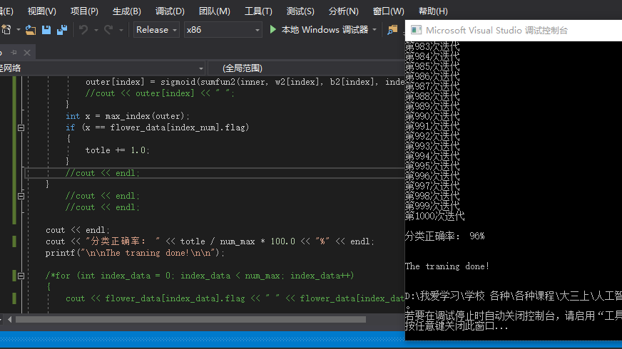

具体思路步骤（附流程图）：
1．	设计一个struct类存储每一个鸢尾花数据，通过动态数组的方式以50个为单位分配内存，进行扩充储存。
2．	进行数据读取与预处理。
a)	对读取的文字分类用if语句进行分类，采用离散式分类法，即100，010，001对三种鸢尾花进行标记（在神经网络最后输出层对应三个输出结果）。
b)	对所有的数据进行归一化处理，公式为：(x-min)/(max-min)
3．	进行神经网络进行前向计算与反馈计算进行训练。迭代1000次。
4．	对训练完成的神经网络进行测试并计算准确率。
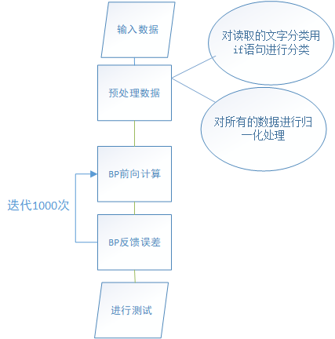
 


代码说明
>>实验中主要用到的变量：
```
1.	struct flower 用于存储每一个数据样本的具体内容，其属性分别为float index1，index2，index3，index4。离散的分类为：float flags1[3]。记录式分类为int flag；
2.	flower *flower_data 使用动态数组存储所有鸢尾花样本数据；
3.	int num_max为数据的总个数；
4.	int num_all为已分配给动态数组的个数大小；
5.	float ypxl[5];用来存储隐藏层的矫正误差；float ypxl2[4];用来存储输出层的矫正误差
6.	float sum[10000][3];用来存储每一个鸢尾花训练时在隐藏层的计算结果；float sum2[10000][3];用来存储每一个鸢尾花训练时在输出层的计算结果；
7.	float inner[3];用来存测试时，输入层到隐藏层的输出结果；
8.	float outer[3];用来存测试时，隐藏层到输出层的输出结果
9.	float w[][],b[][]为二维数组用来存放从输入层到隐藏层的权值；float w2[][],b2[][]为二维数组用来存放从隐藏层到输出层的权值
10.	const int adder = 50; 为每次动态分配新增的大小；
11.	string setosa, versicolor, virginica用来存储每一种鸢尾花的名字。
```


>>主要用到的函数为：
```
1.	void read() 用来将文件夹下的iris.csv文件读入，存储成动态数组结构，并进行预处理。
2.	void find_str(flower *s,int index,string str) 将读入的花朵类型转为对应的100，010，001标识
3.	Type stringToNum(string& str) 将string类型转换为对应的float
4.	float sumfun(flower *data, float *weight, float bias, int index_data) 用来计算输入层到隐藏层的某一节点输出的值
5.	float sumfun2(float *data, float *weight, float bias, int index_data)用来计算隐藏层到输出层的某一节点输出的值
6.	float sigmoid(float sum) 用来将输出的值通过sigmoid函数计算对应的激活值
7.	float sigmoid_dao(float sum) 用来计算sigmoid导数值，即y*（1-y）
8.	float yp(float e,float y) 用来计算输出层的反向误差因子
9.	float cal_data(float a) 用来计算归一化
10.	void changeData()用来将数据进行归一化处理，其中调用了cal_data
11.	int max_index(float *a)用来寻找a数组中存储的最大值的下标，在神经网络测试的计算时确定分类使用。
12.	int main()主函数
```


 

## 具体功能实现过程：
>>数据的读入

&#160;&#160;&#160;&#160;调用自定函数read()，在该函数中使用while语句通过流读取的方式将iris.csv文件读入到程序中，并通过一个栈来存放
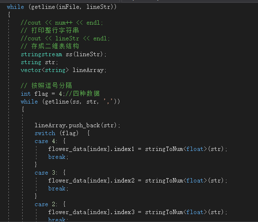

&#160;&#160;&#160;&#160;在流读入之后，通过getline方式，将整个数据结构存入到flower_data动态数组中，分别对应其中的index1，2，3，4。
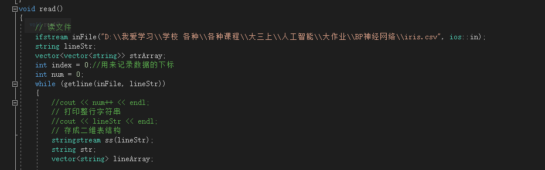


&#160;&#160;&#160;&#160;对于文字形式的鸢尾花分类，通过调用find_str函数，实现对于该数据的离散化形式分类：100，010，001。
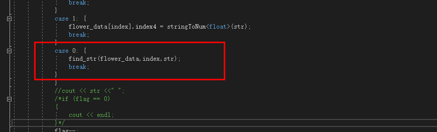

&#160;&#160;&#160;&#160;最后，每次读完数据的时候进行判断，看是否达到动态数组的临界值，若达到则对动态数组flower_data扩容：
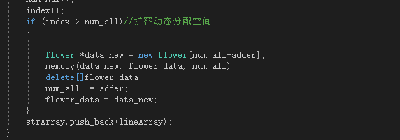 

>>数据的处理

i.	对读取的文字分类用if语句进行分类，采用离散式分类法，即100，010，001对三种鸢尾花进行标记。
在之前提到用find_str函数进行离散分类操作，find_str函数如下图所示：
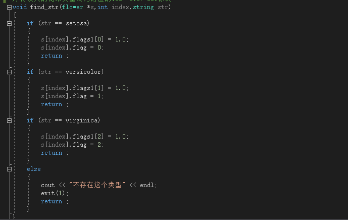

&#160;&#160;&#160;&#160;通过if函数进行判断，将样本中对应的值1存到相应的flag1[x]，其余的值默认为0。

ii.	对所有的数据进行归一化处理，公式为：(x-min)/(max-min)
该步骤调用函数changeData分为两步，第一步是寻找大小值：
在此步骤中，直接使用库中的max与min函数将所有的值比较一次即可输出大小值。
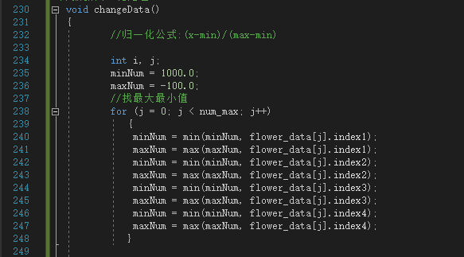

&#160;&#160;&#160;&#160;第二步是归一化：
&#160;&#160;&#160;&#160;在归一化操作中，调用写好的函数cal_data进行归一化操作。cal_data函数即返回计算值(x-min)/(max-min)。整个过程通过for循环，实现归一化操作更新数据。
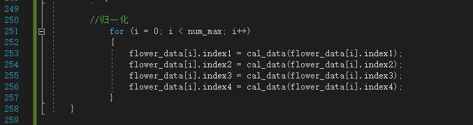

BP的前向传播
&#160;&#160;&#160;&#160;BP的前向传播主要分为两步：输入层→隐藏层，隐藏层→输出层。其公式为：
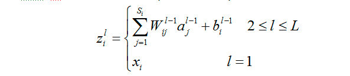
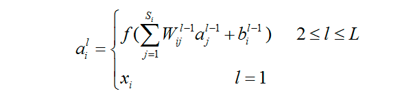
 

&#160;&#160;&#160;&#160;在此处选择的函数f为sigmoid函数：
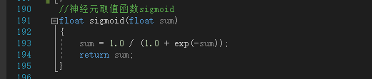

&#160;&#160;&#160;&#160;对于计算，主体部分在main函数中，通过for循环实现运算过程：
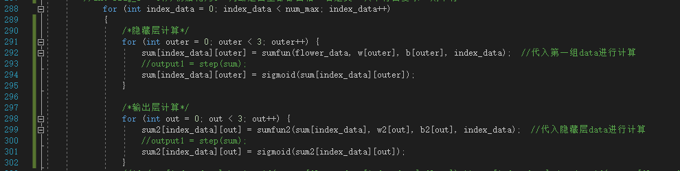
	
&#160;&#160;&#160;&#160;此处for计算调用了函数sumfunc与sumfunc2分别用于计算输入层到隐藏层的权值计算，以及隐藏层到输出层的权值计算，将函数的返回值取sigmoid即为每层的输出激活结果：
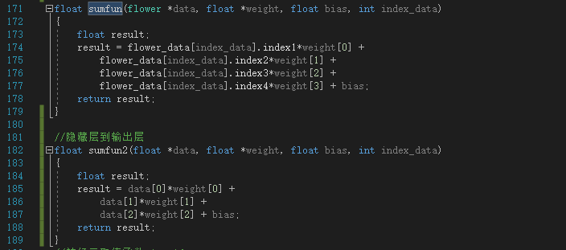

>>BP的误差反馈
&#160;&#160;&#160;&#160;BP的误差反馈分为两步，从输出层→隐藏层，从隐藏层→输入层。
1.	对于输出层→隐藏层，根据所得到的实际结果与目标结果之间的差值来对权值进行调整。Sigmoid函数所需要的导数即为y(1-y)。在模式识别课学过的反向BP解法如下图所示：
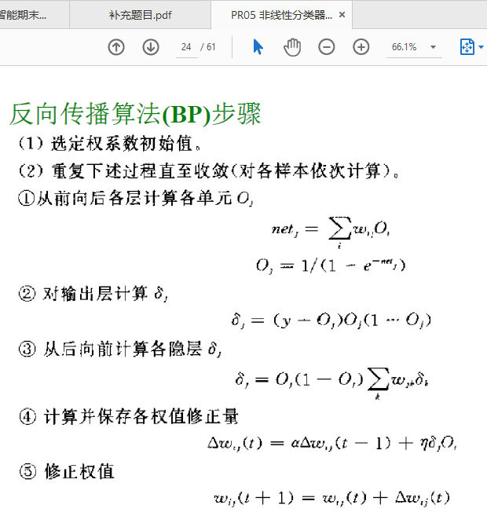

&#160;&#160;&#160;&#160;对于输出层，直接使用公式Δw=学习效率*δ*O[j]，于是得到代码为：
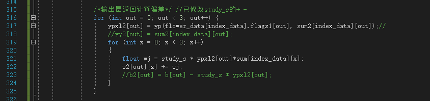

2.	对于隐藏层→输入层，在考虑到本层的基础上还需要考虑对前层的影响。因此，本层的更新分为两步，首先根据输出层的权值更新，更新本层的δ的计算，然后根据Δw=学习效率*δ*X[j]得到本层的权值更新。
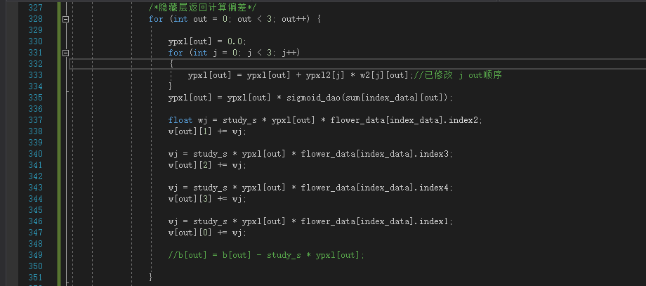

3.	阈值更新
对于阈值b的更新即为Δb=学习效率*δ，更新代码如下：
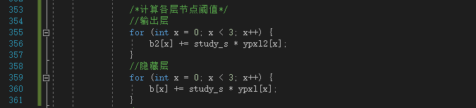

BP神经网络的测试
在进行1000次迭代测试之后，对之前的数据进行测试，即通过隐藏层与输出层的计算，得到三个结果。对于这三个结果，将最接近1的结果作为最终结果，确定该数据的分类。对于这个分类与真正的结果进行比较，若是符合则分类正确的值+1。最后通过求比例，得到最后的结果，代码如下：
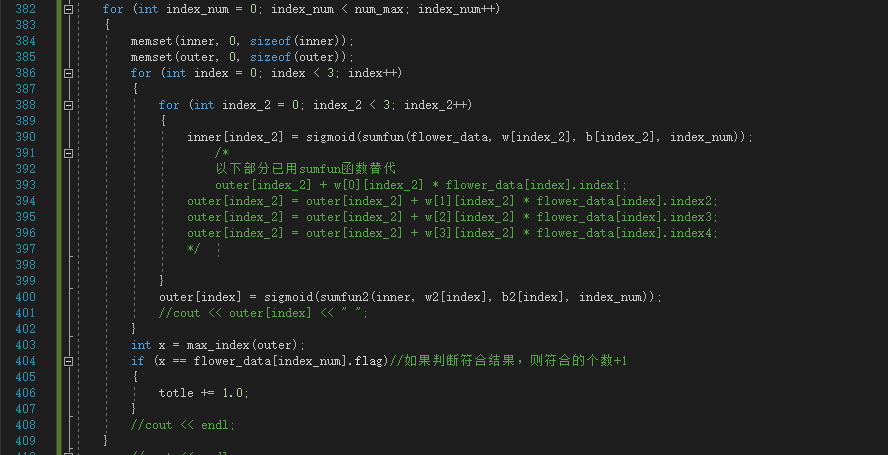

最终得到的结果为96%的识别率。


